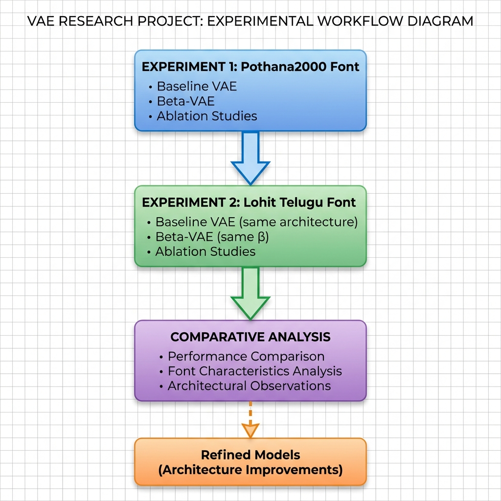
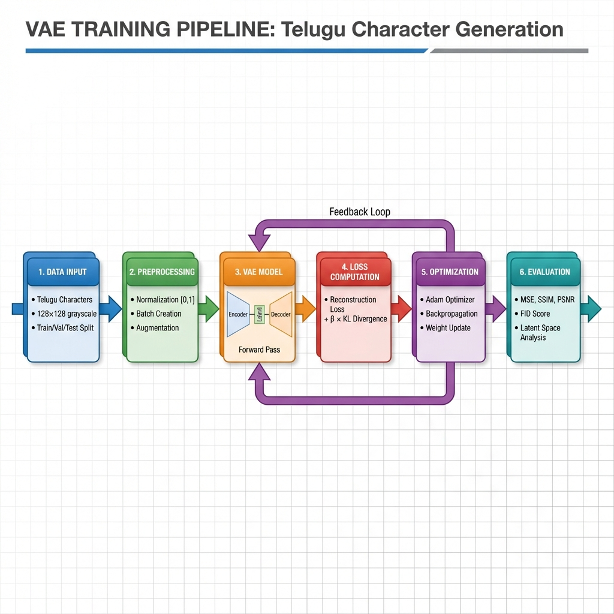
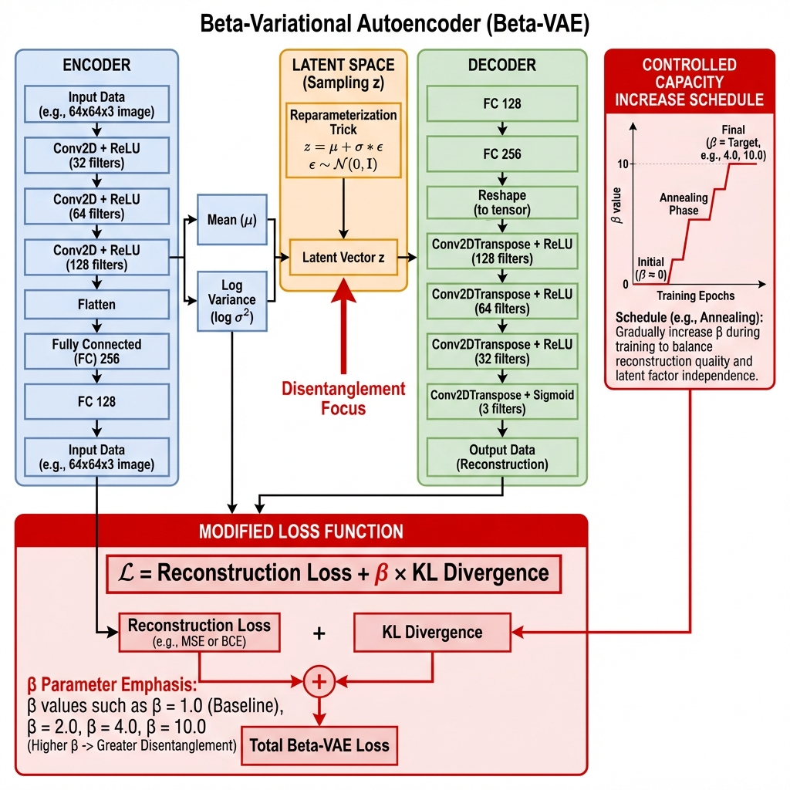
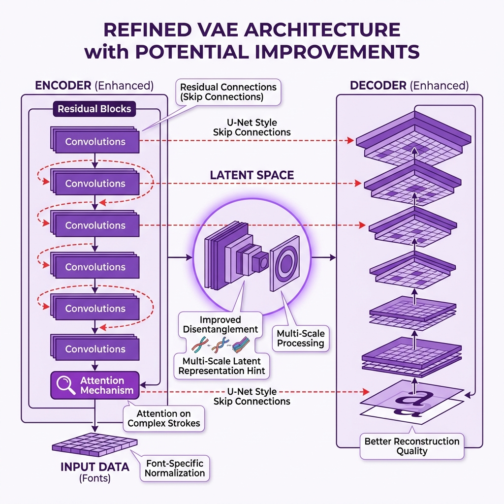

# VARIATIONAL AUTOENCODERS FOR TELUGU CHARACTER GENERATION
## Bachelor's Thesis Project (BTP) - Comprehensive Documentation

**Student:** PAMIDI ROHIT 
**Institution:** IIITS
**ROLL** S20230030398
**Department:** AI & DS  
**Project Domain:**  VARIATIONAL AUTOENCODERS FOR TELUGU CHARACTER GENERATION 

---

<div style="page-break-after: always;"></div>

## TABLE OF CONTENTS

1. [Executive Summary](#executive-summary)
2. [Project Overview & Research Objectives](#project-overview)
3. [Background & Motivation](#background)
4. [Dataset Analysis](#dataset-analysis)
5. [Scope & Classes](#scope)
6. [Plan of Action](#plan-of-action)
7. [Model Architectures](#model-architectures)
   - 7.1 [Model 1: Baseline VAE](#model-1)
   - 7.2 [Model 2: Beta-VAE](#model-2)
   - 7.3 [Model 3: Refined VAE](#model-3)
8. [Experimental Design](#experimental-design)
9. [Evaluation Metrics](#evaluation-metrics)
10. [Expected Outcomes](#expected-outcomes)
11. [Timeline](#timeline)
12. [References](#references)

---

<div style="page-break-after: always;"></div>

## 1. EXECUTIVE SUMMARY <a name="executive-summary"></a>

This Bachelor's Thesis Project (BTP) investigates **Variational Autoencoders (VAEs) for Telugu character generation**, conducting a comprehensive comparative study across two professional Telugu fonts. The research addresses a critical gap in Indic script generation by systematically analyzing how font characteristics affect VAE learning and generation quality.

### Key Highlights

- **Research Focus:** Comparative analysis of VAE performance on Pothana2000 vs. Lohit Telugu fonts
- **Dataset:** 2,080 high-quality Telugu character samples (13 vowels × 2 fonts × 4 sizes × augmentations)
- **Models:** Baseline VAE, Beta-VAE (disentanglement), Refined VAE (observation-driven improvements)
- **Innovation:** First systematic font-comparison study for Telugu character generation with VAEs
- **Impact:** Practical guidelines for applying VAEs to Indic typography and font generation

### Research Questions

1. **Which font trains better with VAEs and why?**
2. How do font characteristics affect VAE latent space organization?
3. What architectural modifications optimize performance per font?
4. Can observation-driven refinements improve cross-font generalization?

### Expected Contributions

✅ **First comparative VAE study** on two Telugu fonts  
✅ **Font-specific performance analysis** identifying characteristics that aid/hinder VAE learning  
✅ **Architectural observations and refinements** based on experimental evidence  
✅ **Public benchmark dataset** with reproducible experimental protocol  
✅ **Practical guidelines** for VAE application to Indic fonts

---

<div style="page-break-after: always;"></div>

## 2. PROJECT OVERVIEW & RESEARCH OBJECTIVES <a name="project-overview"></a>

### 2.1 Primary Research Goal

Develop and **systematically compare VAE architectures** for Telugu character generation across different fonts, analyzing:

- **Font-specific performance differences** (reconstruction quality, generation fidelity)
- **Character reconstruction fidelity per font** (MSE, SSIM, PSNR metrics)
- **Latent space quality and interpretability** (disentanglement, smoothness)
- **Architectural adaptations for optimal performance** (observation-driven refinements)

### 2.2 Core Research Questions

| # | Research Question |
|---|-------------------|
| **RQ1** | How effectively can VAE architectures learn and generate complex Telugu script morphology? |
| **RQ2** | **Which font (Pothana2000 vs. Lohit Telugu) achieves better VAE performance and why?** |
| **RQ3** | What architectural modifications yield best performance for each font? |
| **RQ4** | How do font characteristics (stroke complexity, character variation) affect VAE latent space organization? |
| **RQ5** | What architectural refinements can improve cross-font generalization? |

### 2.3 Research Gap & Novelty

#### **IDENTIFIED RESEARCH GAP:**

> - ⚠️ Limited application of modern VAE architectures to Telugu/Indic printed fonts
> - ⚠️ **No comparative analysis** of VAE performance across different Indic fonts
> - ⚠️ Missing understanding of **font-specific characteristics** affecting VAE training
> - ⚠️ Lack of architectural guidelines for Telugu character generation
> - ⚠️ No standardized benchmark for printed Telugu font generation

#### **OUR PROPOSED CONTRIBUTIONS:**

> 1. **First systematic comparison** of VAE performance on two Telugu fonts
> 2. **Font-specific performance analysis** identifying which visual properties aid/hinder VAE learning
> 3. **Architectural observations and refinements** based on comparative experiments
> 4. **Extensive empirical analysis** of latent space quality per font
> 5. **Public benchmark dataset** with reproducible experimental protocol
> 6. **Practical guidelines** for applying VAEs to Indic typography

### 2.4 Significance & Impact

**For Research Community:**
- First benchmark for VAE-based Telugu font generation
- Methodology applicable to other Indic scripts (Devanagari, Kannada, Tamil, etc.)
- Insights into font characteristics affecting generative model performance

**For Practical Applications:**
- Synthetic font generation for OCR training data
- Digital typography and automated font design
- Document synthesis for data augmentation
- Font interpolation and style transfer

---

<div style="page-break-after: always;"></div>

## 3. BACKGROUND & MOTIVATION <a name="background"></a>

### 3.1 Telugu Script Characteristics

**Telugu** is a Dravidian language with **~74 million native speakers**, primarily in the Indian states of Andhra Pradesh and Telangana. The Telugu script is characterized by:

- **Complex morphology:** Rounded, curved characters with intricate stroke patterns
- **Extensive character set:** 16 vowels, 36 consonants, plus conjuncts
- **Modular structure:** Vowel diacritics attach to consonant bases
- **Visual complexity:** Characters have multiple loops, curves, and connected strokes

**Why This Matters for Deep Learning:**
- Complex visual features challenge generative models
- Requires models to learn intricate stroke patterns
- More difficult than simple Latin alphanumeric characters

### 3.2 Variational Autoencoders (VAEs)

**Variational Autoencoders (VAEs)** are probabilistic generative models that:

1. **Learn latent representations:** Compress high-dimensional data (images) into low-dimensional latent space
2. **Enable generation:** Sample from latent space to generate new, realistic data
3. **Provide interpretability:** Latent dimensions can capture meaningful factors of variation

**VAE Advantages:**
- ✅ Stable training (compared to GANs)
- ✅ Interpretable latent space
- ✅ Probabilistic framework with theoretical foundation
- ✅ Good for controlled generation

**VAE Challenges:**
- ⚠️ Often produce blurry reconstructions
- ⚠️ Posterior collapse (KL divergence → 0)
- ⚠️ Balancing reconstruction vs. regularization

### 3.3 Why This Research is Important

#### **Problem: Data Scarcity for Indic Languages**

Indic scripts, including Telugu, suffer from limited high-quality training data for:
- Optical Character Recognition (OCR) systems
- Handwriting recognition
- Font generation and typography

#### **Solution: Generative Models**

VAEs can:
- **Generate synthetic training data** for OCR
- **Augment limited datasets** with realistic variations
- **Enable font-style transfer** and automated typography
- **Provide interpretable representations** for linguistic analysis

#### **Gap: Lack of Indic-Specific Research**

While VAEs have been extensively studied for:
- General image generation (faces, objects)
- Latin character generation (MNIST, fonts)

**There is minimal research on:**
- VAE application to complex Indic scripts
- Comparative analysis across different Indic fonts
- Font-specific architecture optimization

**This research fills that gap.**

### 3.4 State-of-the-Art Context (2024)

**Current Landscape:**

| Domain | State-of-the-Art | Performance |
|--------|------------------|-------------|
| **Indic OCR** | CNN-based (VGG16, ResNet) | 95-98% accuracy |
| **Character Generation** | GANs, Diffusion Models | High quality but unstable |
| **Telugu Processing** | Limited research | Underexplored |
| **VAEs for Characters** | Mostly Latin scripts | Gap for Indic |

**Recent VAE Advancements (2023-2024):**
- **Beta-VAE:** Improved disentanglement through weighted KL divergence
- **KL Annealing:** Prevents posterior collapse via gradual regularization
- **Hierarchical VAEs:** Multi-scale latent representations
- **Perceptual Losses:** Better reconstruction quality

**Our Position:**
We build on these advancements to systematically study VAEs for Telugu fonts, providing the first comparative analysis and architectural guidelines.

---

<div style="page-break-after: always;"></div>

## 4. DATASET ANALYSIS <a name="dataset-analysis"></a>

### 4.1 Dataset Overview


**Dataset Name:** `dataset_Rohit` - Telugu Character Generation Benchmark

**Comprehensive Statistics:**

| Metric | Value |
|--------|-------|
| **Total Samples** | **2,080** |
| **Unique Alphabets** | 13 Telugu vowels (swaras) |
| **Fonts** | 2 (Pothana2000, Lohit Telugu) |
| **Font Sizes** | 4 (10pt, 14pt, 18pt, 22pt) |
| **Samples per Alphabet** | 160 |
| **Samples per Font** | 1,040 |
| **Samples per Size** | 520 |
| **Image Resolution** | 128×128 pixels |
| **DPI** | 300 (professional quality) |
| **Format** | PNG (grayscale) |
| **Augmentation Variations** | 222 unique combinations |

### 4.2 Telugu Alphabets Covered

**13 Fundamental Vowels (Achulu):**

| Code | Character | Transliteration | Samples |
|------|-----------|-----------------|---------|
| `a` | అ | a | 160 |
| `aa` | ఆ | ā (long a) | 160 |
| `i` | ఇ | i | 160 |
| `ii` | ఈ | ī (long i) | 160 |
| `u` | ఉ | u | 160 |
| `uu` | ఊ | ū (long u) | 160 |
| `ri` | ఋ | ṛ (vocalic r) | 160 |
| `e` | ఎ | e | 160 |
| `ai` | ఐ | ai | 160 |
| `o` | ఒ | o | 160 |
| `au` | ఔ | au | 160 |
| `am` | అం | aṃ (anusvara) | 160 |
| `aha` | అః | aḥ (visarga) | 160 |

**Why Vowels?**
- Core building blocks of Telugu script
- Represent diverse character morphology
- Sufficient complexity for rigorous BTP research
- Manageable scope for deep architectural analysis

### 4.3 Font Details

#### **Font 1: Pothana2000**
- **Type:** Professional Telugu font, widely used
- **Characteristics:** Modern, clean rendering with consistent stroke widths
- **Samples:** 1,040 (50% of dataset)
- **Use Case:** Standard printed text, documents

#### **Font 2: Lohit Telugu**
- **Type:** Open-source Telugu font
- **Characteristics:** Alternative stroke style, different visual aesthetics
- **Samples:** 1,040 (50% of dataset)
- **Use Case:** Cross-font comparison, style diversity

**Distribution:** Perfectly balanced - 80 samples per (alphabet × font)

### 4.4 Augmentation Strategy

**Systematic Augmentation for Robust Learning:**

| Technique | Frequency | Purpose |
|-----------|-----------|---------|
| **Rotation** | 682× | Orientation invariance |
| **Translation** | 679× | Position invariance |
| **Scaling** | 678× | Size variation |
| **Gamma Correction** | 665× | Brightness variation |
| **Contrast Adjustment** | 665× | Intensity variation |
| **Stroke Erosion** | 339× | Thinner characters |
| **Stroke Dilation** | 317× | Thicker characters |
| **Base (No Aug)** | 104× | Original samples |

**Total Unique Combinations:** 222 different augmentation recipes

**Benefits:**
- ✅ Increases effective dataset size
- ✅ Prevents overfitting
- ✅ Simulates real-world variation
- ✅ Improves model generalization

### 4.5 Dataset Strengths

1. **High Quality:** 128×128 resolution at 300 DPI (professional-grade)
2. **Perfectly Balanced:** Equal samples across alphabets, fonts, sizes
3. **Systematic Variation:** Controlled augmentation strategies
4. **Rich Metadata:** Complete traceability and reproducibility
5. **Multi-Scale:** 4 font sizes enable size-invariance testing

### 4.6 Experimental Data Split

**Stratified Split Strategy:**

```
Total: 2,080 samples
├── Training Set:   1,456 samples (70%)
├── Validation Set:   312 samples (15%)
└── Test Set:         312 samples (15%)

Stratification: By alphabet to ensure all characters in each split
```

**Per-Font Experiments:**

```
Experiment 1 (Pothana2000): 1,040 samples
├── Train:  728 samples
├── Val:    156 samples
└── Test:   156 samples

Experiment 2 (Lohit Telugu): 1,040 samples
├── Train:  728 samples
├── Val:    156 samples
└── Test:   156 samples
```

---

<div style="page-break-after: always;"></div>

## 5. SCOPE & CLASSES <a name="scope"></a>

### 5.1 Project Scope

**IN SCOPE:**

✅ **Character Generation:** Telugu vowel characters (13 classes)  
✅ **Font Comparison:** Pothana2000 vs. Lohit Telugu  
✅ **VAE Variants:** Baseline, Beta-VAE, Refined VAE  
✅ **Comparative Analysis:** Font-specific performance evaluation  
✅ **Architectural Study:** Observation-driven refinements  
✅ **Latent Space Analysis:** Disentanglement, interpretability  
✅ **Quantitative Metrics:** MSE, SSIM, PSNR, FID, MIG  
✅ **Qualitative Evaluation:** Visual inspection, latent traversals  

**OUT OF SCOPE:**

❌ Consonants and conjuncts (future expansion)  
❌ Handwritten character generation (separate research direction)  
❌ Real-time inference optimization  
❌ Mobile/edge deployment  
❌ Cross-font style transfer (not primary goal)  
❌ OCR downstream task evaluation (optional if time permits)  

### 5.2 Character Classes

**Number of Classes:** **13 Telugu vowels**

```
Classes = {అ, ఆ, ఇ, ఈ, ఉ, ఊ, ఋ, ఎ, ఐ, ఒ, ఔ, అం, అః}
```

**Class Distribution:**

| Class | Pothana Samples | Lohit Samples | Total |
|-------|----------------|---------------|-------|
| అ (a) | 80 | 80 | 160 |
| ఆ (aa) | 80 | 80 | 160 |
| ఇ (i) | 80 | 80 | 160 |
| ఈ (ii) | 80 | 80 | 160 |
| ఉ (u) | 80 | 80 | 160 |
| ఊ (uu) | 80 | 80 | 160 |
| ఋ (ri) | 80 | 80 | 160 |
| ఎ (e) | 80 | 80 | 160 |
| ఐ (ai) | 80 | 80 | 160 |
| ఒ (o) | 80 | 80 | 160 |
| ఔ (au) | 80 | 80 | 160 |
| అం (am) | 80 | 80 | 160 |
| అః (aha) | 80 | 80 | 160 |
| **TOTAL** | **1,040** | **1,040** | **2,080** |

**Perfectly Balanced:** Each class has identical sample count, preventing class imbalance issues.

### 5.3 Task Formulation

**Unsupervised Generative Modeling:**

- **Input:** Telugu character image `x ∈ ℝ^(128×128)`
- **Goal:** Learn latent representation `z ∈ ℝ^d` (d = latent dimension)
- **Output:** Reconstructed image `x̂ ∈ ℝ^(128×128)`
- **Generation:** Sample `z ~ N(0,I)`, decode to generate new character

**Not Classification:** Models are unsupervised (no class labels during training)

---

<div style="page-break-after: always;"></div>

## 6. PLAN OF ACTION <a name="plan-of-action"></a>

### 6.1 Experimental Workflow Diagram



### 6.2 Detailed Research Phases

#### **Phase 1: Literature Review & Foundation** (Weeks 1-2)

**Objectives:**
- Deep dive into VAE theory and recent advancements
- Study Indic script generation techniques
- Analyze dataset characteristics
- Finalize research methodology

**Deliverables:**
- ✅ Literature review summary
- ✅ Research plan documentation
- ✅ Dataset analysis report

---

#### **Phase 2: Environment Setup & Data Preparation** (Week 3)

**Tasks:**
1. **Setup Development Environment:**
   - Install PyTorch 2.0+, CUDA
   - Configure Weights & Biases for experiment tracking
   - Setup Jupyter notebooks for experimentation

2. **Data Pipeline Implementation:**
   ```python
   # Pseudocode
   - Create DataLoader for Pothana2000 (1,040 samples)
   - Create DataLoader for Lohit Telugu (1,040 samples)
   - Implement stratified train/val/test split (70/15/15)
   - Normalize images to [0,1]
   - Setup batch processing (batch_size=64)
   ```

3. **Baseline Code Structure:**
   ```
   btp/
   ├── data/
   │   ├── pothana2000/
   │   └── lohit_telugu/
   ├── models/
   │   ├── vae_baseline.py
   │   ├── vae_beta.py
   │   └── vae_refined.py
   ├── utils/
   │   ├── data_loader.py
   │   ├── metrics.py
   │   └── visualization.py
   └── experiments/
       ├── exp1_pothana/
       └── exp2_lohit/
   ```

**Deliverables:**
- ✅ Working data pipeline
- ✅ Training infrastructure
- ✅ Experiment tracking setup

---

#### **Phase 3: Experiment 1 - Pothana2000 Font** (Weeks 4-5)

**Goal:** Train and evaluate VAE models on Pothana2000 font

**Models to Train:**
1. **Baseline VAE**
   - Latent dimensions: {128, 256}
   - Learning rates: {1e-4, 5e-4}
   - Train 100-200 epochs

2. **Beta-VAE**
   - Beta values: {1.0, 2.0, 4.0, 10.0}
   - Cyclical vs. monotonic annealing
   - Disentanglement analysis

3. **Ablations:**
   - Architecture depth (4, 5, 6 conv layers)
   - Loss functions (BCE, MSE, SSIM)
   - Batch sizes (32, 64, 128)

**Evaluation:**
- Reconstruction quality (MSE, SSIM, PSNR)
- Generation quality (FID score)
- Latent space quality (MIG, t-SNE)
- Training curves and convergence

**Deliverables:**
- ✅ Trained models (checkpoints saved)
- ✅ Quantitative results table
- ✅ Qualitative visualizations
- ✅ Experiment logs (WandB)

---

#### **Phase 4: Experiment 2 - Lohit Telugu Font** (Weeks 6-7)

**Goal:** Train identical models on Lohit Telugu for controlled comparison

**Protocol:**
- **Use EXACT SAME architectures** as Experiment 1
- Same hyperparameters (latent dims, learning rates, betas)
- Same training schedule (epochs, batch size)
- Same evaluation metrics

**Why Identical Protocol?**
- Isolates font effect from architectural choices
- Enables fair comparison
- Identifies font-specific challenges

**Deliverables:**
- ✅ Trained models on Lohit Telugu
- ✅ Quantitative results table
- ✅ Qualitative visualizations
- ✅ Direct comparison ready

---

#### **Phase 5: Comparative Analysis** (Week 8)

**CRITICAL PHASE:** Analyze which font performs better and why

**Analysis Components:**

1. **Quantitative Comparison:**
   - Create side-by-side performance tables
   - Statistical significance testing (paired t-tests)
   - Identify performance gaps

2. **Visual Comparison:**
   - Reconstruction quality: Pothana vs. Lohit
   - Generated samples quality
   - Latent space organization (t-SNE plots)

3. **Font Characteristics Analysis:**
   - Stroke complexity metrics
   - Character variation within font
   - Augmentation effectiveness
   - Why does one font train better?

4. **Architectural Observations:**
   - Which architectures work better for which font?
   - Are certain latent dimensions better for one font?
   - Does beta parameter effect differ by font?

**Key Questions to Answer:**
- 🔍 Which font achieves lower reconstruction error?
- 🔍 Which font has better latent space organization?
- 🔍 What font properties make VAE learning easier?
- 🔍 What architectural changes could help the weaker font?

**Deliverables:**
- ✅ Comparative analysis report
- ✅ Font characteristics documentation
- ✅ Architectural observation notes
- ✅ Refinement recommendations

---

#### **Phase 6: Refined Model Development** (Week 9) [OPTIONAL]

**Goal:** Implement architectural improvements based on Phase 5 observations

**Potential Refinements:**
```python
If Pothana performs better:
    - Analyze: simpler strokes? less variation?
    - Refine for Lohit: deeper encoder, attention mechanisms
    
If Lohit performs better:
    - Analyze: richer features? more diversity?
    - Refine for Pothana: different normalization, loss weights

If similar performance:
    - Identify shared bottlenecks
    - Implement multi-scale processing, residual connections
```

**Experimentation:**
- Test refined architectures on BOTH fonts
- Validate improvements
- Document design rationale

**Deliverables:**
- ✅ Refined VAE implementation
- ✅ Performance improvement validation
- ✅ Architectural design document

---

#### **Phase 7: Results Compilation & Visualization** (Week 10)

**Goal:** Create publication-quality figures and tables

**Figures to Generate:**
1. Experimental workflow diagram ✓ (already created)
2. Architecture diagrams (all 3 models) ✓ (already created)
3. Dataset overview ✓ (already created)
4. Training curves (loss, metrics over epochs)
5. Reconstruction examples (original vs. reconstructed)
6. Generated samples grid
7. Latent space visualizations (t-SNE/UMAP)
8. Font comparison charts (bar plots, heatmaps)
9. Ablation study results
10. Refined model improvements

**Tables to Create:**
1. Dataset statistics
2. **Font comparison table (PRIMARY):**
   | Metric | Pothana | Lohit | Winner | Δ% |
3. Model performance per font
4. Ablation study results
5. Hyperparameter sensitivity

**Deliverables:**
- ✅ All figures in high resolution
- ✅ All tables formatted
- ✅ Results summary document

---

#### **Phase 8: Paper Writing & Documentation** (Weeks 11-12)

**Goal:** Write research paper for conference submission

**Paper Structure:**
1. **Abstract** (200 words)
2. **Introduction** (1.5 pages)
   - Motivation, problem statement
   - Research questions, contributions
3. **Related Work** (1.5 pages)
   - VAE literature, Indic scripts, character generation
4. **Methodology** (2 pages)
   - Dataset description
   - Model architectures (3 variants)
   - Training procedure
5. **Experiments** (2 pages)
   - Experimental setup
   - Evaluation metrics
   - Implementation details
6. **Results** (2.5 pages)
   - Experiment 1 results (Pothana)
   - Experiment 2 results (Lohit)
   - Comparative analysis ← **Most Important**
   - Ablation studies
7. **Discussion** (1 page)
   - Why one font performs better
   - Architectural insights
   - Limitations
8. **Conclusion** (0.5 pages)
   - Summary, future work

**Page Limit:** 8-10 pages (conference format)

**Deliverables:**
- ✅ Complete research paper draft
- ✅ Supplementary materials
- ✅ Camera-ready figures
- ✅ Code release preparation

---

### 6.3 Timeline Summary

| Week | Phase | Milestone |
|------|-------|-----------|
| 1-2 | Literature Review | Foundation |
| 3 | Setup & Data Prep | Infrastructure ready |
| 4-5 | Experiment 1 (Pothana) | First results |
| 6-7 | Experiment 2 (Lohit) | Second results |
| 8 | Comparative Analysis | **Key insights** |
| 9 | Refined Models | Improvements |
| 10 | Visualization | Figures ready |
| 11-12 | Paper Writing | Submission |

**Total Duration:** 12 weeks (3 months)

---

<div style="page-break-after: always;"></div>

## 7. MODEL ARCHITECTURES <a name="model-architectures"></a>

### 7.1 Training Pipeline Overview



---

### 7.2 Model 1: Baseline VAE <a name="model-1"></a>


#### **Purpose**
Establish baseline performance for Telugu character generation using standard VAE architecture.

#### **Architecture Specification**

**ENCODER (Recognition Network):**

| Layer | Type | Output Shape | Parameters |
|-------|------|--------------|------------|
| Input | Image | (batch, 1, 128, 128) | - |
| Conv1 | Conv2D + BN + LeakyReLU | (batch, 32, 64, 64) | kernel=4×4, stride=2, filters=32 |
| Conv2 | Conv2D + BN + LeakyReLU | (batch, 64, 32, 32) | kernel=4×4, stride=2, filters=64 |
| Conv3 | Conv2D + BN + LeakyReLU | (batch, 128, 16, 16) | kernel=4×4, stride=2, filters=128 |
| Conv4 | Conv2D + BN + LeakyReLU | (batch, 256, 8, 8) | kernel=4×4, stride=2, filters=256 |
| Flatten | Reshape | (batch, 16384) | - |
| Dense | Fully Connected | (batch, 512) | ReLU activation |
| μ head | Fully Connected | (batch, latent_dim) | No activation |
| log σ² head | Fully Connected | (batch, latent_dim) | No activation |

**LATENT SPACE (Reparameterization):**

```
z = μ + σ ⊙ ε
where:
  μ = mean vector (latent_dim)
  σ = exp(0.5 × log σ²)
  ε ~ N(0, I)
  ⊙ = element-wise multiplication
```

**DECODER (Generation Network):**

| Layer | Type | Output Shape | Parameters |
|-------|------|--------------|------------|
| Input | Latent Vector | (batch, latent_dim) | - |
| Dense1 | Fully Connected | (batch, 16384) | ReLU activation |
| Reshape | 3D Tensor | (batch, 256, 8, 8) | - |
| ConvT1 | ConvTranspose2D + BN + ReLU | (batch, 256, 16, 16) | kernel=4×4, stride=2, filters=256 |
| ConvT2 | ConvTranspose2D + BN + ReLU | (batch, 128, 32, 32) | kernel=4×4, stride=2, filters=128 |
| ConvT3 | ConvTranspose2D + BN + ReLU | (batch, 64, 64, 64) | kernel=4×4, stride=2, filters=64 |
| ConvT4 | ConvTranspose2D + BN + ReLU | (batch, 32, 128, 128) | kernel=4×4, stride=2, filters=32 |
| Output | Conv2D + Sigmoid | (batch, 1, 128, 128) | kernel=3×3, stride=1 |

#### **Loss Function**

```python
Total Loss = Reconstruction Loss + KL Divergence Loss

# 1. Reconstruction Loss (Binary Cross-Entropy)
L_recon = -Σ [x·log(x̂) + (1-x)·log(1-x̂)]

# 2. KL Divergence Loss
L_KL = -0.5 · Σ [1 + log(σ²) - μ² - σ²]

# Total VAE Loss
L_VAE = L_recon + L_KL
```

#### **Hyperparameters**

| Parameter | Values to Explore |
|-----------|-------------------|
| **Latent Dimension** | 128, 256 |
| **Learning Rate** | 1e-4, 5e-4, 1e-3 |
| **Batch Size** | 32, 64 |
| **Epochs** | 100-200 (with early stopping) |
| **Optimizer** | Adam (β₁=0.9, β₂=0.999) |
| **Weight Decay** | 1e-5 |

#### **Expected Outputs**
- Reconstruction quality baseline
- Latent space organization
- Generation capability from random sampling

---

<div style="page-break-after: always;"></div>

### 7.3 Model 2: Beta-VAE (Disentangled Representations) <a name="model-2"></a>



#### **Purpose**
Learn **disentangled latent representations** where individual latent dimensions capture independent factors of variation (e.g., character identity vs. stroke thickness vs. orientation).

#### **Architecture**
**Same architecture as Baseline VAE** (encoder + latent + decoder)

**KEY DIFFERENCE: Modified Loss Function**

#### **Modified Loss Function**

```python
Total Loss = Reconstruction Loss + β × KL Divergence Loss

# β-VAE Loss
L_β-VAE = L_recon + β · L_KL

where:
  β > 1 encourages stronger disentanglement
  β = 1 reduces to standard VAE
  β < 1 prioritizes reconstruction over regularization
```

#### **Beta Parameter Strategy**

**1. Fixed Beta Values:**

| β Value | Effect | Use Case |
|---------|--------|----------|
| **β = 1.0** | Standard VAE | Baseline comparison |
| **β = 2.0** | Mild disentanglement | Balanced |
| **β = 4.0** | Moderate disentanglement | **Recommended** |
| **β = 10.0** | Strong disentanglement | May hurt reconstruction |

**2. Controlled Capacity Increase (Advanced):**

```python
# Gradually increase capacity target C
C_target: 0 → 25 linearly over epochs

# Modified loss
L = L_recon + γ · |L_KL - C_target|
where γ = 100 (weighting factor)
```

**3. Cyclical Annealing:**

```python
# β varies cyclically during training
β(t) = β_min + (β_max - β_min) · (1 + cos(2πt/T)) / 2

Parameters:
  β_min = 0.0
  β_max = 1.0 (or higher)
  T = cycle_length (e.g., 10 epochs)
```

#### **Disentanglement Evaluation**

**Metrics:**
1. **Mutual Information Gap (MIG):** Measures how much each latent dimension captures a single factor
2. **Separated Attribute Predictability (SAP):** Measures ease of predicting factor from single latent
3. **Disentanglement, Completeness, Informativeness (DCI):** Comprehensive metric

**Visualization:**
- **Latent Traversals:** Fix all dims except one, vary that dimension, observe changes
- **t-SNE of Latent Space:** Colored by alphabet, should show clear clusters

#### **Expected Outcomes**
- Better latent space organization
- Interpretable latent dimensions
- Potentially blurrier reconstructions (trade-off)

---

<div style="page-break-after: always;"></div>

### 7.4 Model 3: Refined VAE (Observation-Driven Improvements) <a name="model-3"></a>



#### **Purpose**
Implement **architectural improvements** identified from comparative analysis of Experiments 1 & 2.

#### **Refinement Strategy**

**AFTER analyzing Pothana vs. Lohit performance, we will:**

**Scenario 1: If one font reconstructs better**
```
Analysis Questions:
  - What makes that font easier for VAE?
  - Simpler stroke patterns?
  - Less intra-class variation?
  - Better augmentation effectiveness?

Refinement Approach:
  - Adjust architecture to handle harder font better
  - Test refinements on both fonts
```

**Scenario 2: If latent space organization differs significantly**
```
Analysis Questions:
  - Why is one latent space more organized?
  - Architectural bottlenecks?
  - Insufficient capacity for complex font?

Refinement Approach:
  - Adjust encoder/decoder depth or capacity
  - Improve disentanglement for problematic font
```

#### **Potential Architectural Enhancements**

**1. Residual Connections (ResNet-style)**

```python
# Add skip connections within encoder/decoder
class ResidualBlock(nn.Module):
    def forward(self, x):
        residual = x
        out = self.conv1(x)
        out = self.bn1(out)
        out = self.relu(out)
        out = self.conv2(out)
        out = self.bn2(out)
        out += residual  # Skip connection
        return self.relu(out)

Benefits:
  - Easier gradient flow
  - Enables deeper networks
  - Better feature learning
```

**2. Attention Mechanisms**

```python
# Self-attention before latent space
class Attention(nn.Module):
    def forward(self, x):
        # Compute attention weights on spatial features
        # Focus on complex stroke regions
        attention_weights = softmax(W_q @ W_k.T)
        attended_features = attention_weights @ W_v
        return attended_features

Benefits:
  - Focus on important character regions
  - Better handling of complex strokes
  - Improved reconstruction of intricate features
```

**3. Multi-Scale Processing (Pyramid Features)**

```python
# Extract features at multiple scales
encoder_outputs = {
    '8x8': conv4_output,
    '16x16': conv3_output,
    '32x32': conv2_output
}

# Combine multi-scale info for latent representation
latent = combine(encoder_outputs)

Benefits:
  - Capture both fine details and global structure
  - Better for characters with multi-scale features
```

**4. Font-Specific Normalization**

```python
# Adaptive normalization based on font statistics
if font == 'pothana':
    normalization_params = pothana_stats
else:
    normalization_params = lohit_stats

x_normalized = (x - mean) / std

Benefits:
  - Account for font-specific intensity distributions
  - Improve training stability
```

**5. Modified Loss Weighting**

```python
# Font-aware loss balancing
if font == 'harder_font':
    α = 1.2  # Increase reconstruction weight
else:
    α = 1.0

L = α * L_recon + β * L_KL

Benefits:
  - Compensate for font-specific challenges
  - Balance reconstruction vs. regularization per font
```

#### **Expected Deliverables**

- **Improved Model:** Better performance on BOTH fonts
- **Ablation Analysis:** Which refinement helps most?
- **Generalizable Insights:** Applicable to other Indic fonts

---

<div style="page-break-after: always;"></div>

## 8. EXPERIMENTAL DESIGN <a name="experimental-design"></a>

### 8.1 Two-Font Independent Experiments

**Core Design Principle:** **Identical protocol, different fonts**

```
┌─────────────────────────────────────┐
│  EXPERIMENT 1: Pothana2000          │
│  - Same architectures               │
│  - Same hyperparameters             │
│  - Same training schedule           │
│  - Same evaluation metrics          │
└─────────────────────────────────────┘
                 vs.
┌─────────────────────────────────────┐
│  EXPERIMENT 2: Lohit Telugu         │
│  - Same architectures               │
│  - Same hyperparameters             │
│  - Same training schedule           │
│  - Same evaluation metrics          │
└─────────────────────────────────────┘

              ↓ COMPARE ↓

┌─────────────────────────────────────┐
│  ANSWER: Which font performs        │
│  better with VAEs and WHY?          │
└─────────────────────────────────────┘
```

### 8.2 Controlled Variables

**CONSTANT Across Both Experiments:**
- ✅ Architecture design (layer configs identical)
- ✅ Hyperparameters (learning rate, batch size, epochs)
- ✅ Optimization strategy (Adam, learning rate schedule)
- ✅ Loss functions (same reconstruction + KL formulation)
- ✅ Evaluation metrics (same metrics, same code)
- ✅ Random seeds (for reproducibility)

**VARIABLE:**
- 🔄 **Font Only** (Pothana2000 vs. Lohit Telugu)

**Why This Design?**
- Isolates font effect from all other factors
- Enables fair, controlled comparison
- Identifies font-specific challenges clearly

### 8.3 Experiment Tracking

**Tools:**
- **Weights & Biases (WandB)** for live tracking
- **TensorBoard** as backup

**Tracked Metrics (Per Epoch):**
- Training loss (total, reconstruction, KL)
- Validation loss
- MSE, SSIM, PSNR on validation set
- FID score (computed periodically)
- Learning rate (if scheduled)

**Saved Artifacts:**
- Model checkpoints (best validation loss)
- Generated samples (every 10 epochs)
- Latent space visualizations (every 20 epochs)

---

<div style="page-break-after: always;"></div>

## 9. EVALUATION METRICS <a name="evaluation-metrics"></a>

### 9.1 Quantitative Metrics

#### **Reconstruction Quality**

**1. Mean Squared Error (MSE) ↓**
```
MSE = (1/N) Σᵢ ||xᵢ - x̂ᵢ||²

Lower is better
Range: [0, ∞)
```

**2. Structural Similarity Index (SSIM) ↑**
```
SSIM(x, x̂) ∈ [-1, 1]

Considers:
  - Luminance similarity
  - Contrast similarity
  - Structural similarity

Higher is better (closer to 1)
```

**3. Peak Signal-to-Noise Ratio (PSNR) ↑**
```
PSNR = 20 · log₁₀(MAX_PIXEL / √MSE)

Higher is better (typically 20-40 dB)
```

#### **Generation Quality**

**4. Fréchet Inception Distance (FID) ↓**
```
Measures distribution distance between real and generated images
Uses Inception network features

Lower is better (<50 is good, <10 is excellent)
```

#### **Latent Space Quality**

**5. Mutual Information Gap (MIG) ↑**
```
Measures disentanglement
Range: [0, 1]
Higher = better disentanglement
```

**6. Separated Attribute Predictability (SAP) ↑**
```
Measures how well a single latent predicts a factor
Range: [0, 1]
```

### 9.2 Qualitative Evaluation

1. **Visual Reconstruction:** Side-by-side original vs. reconstructed
2. **Generated Samples:** Random sampling from N(0,I)
3. **Latent Traversals:** Fix all dims except one, vary it
4. **Interpolation:** Smooth transitions between characters

### 9.3 Statistical Testing

**Paired t-tests** for font comparison:
```
H₀: μ_Pothana = μ_Lohit
H₁: μ_Pothana ≠ μ_Lohit

α = 0.05
```

**Effect Size:** Cohen's d for practical significance

---

<div style="page-break-after: always;"></div>

## 10. EXPECTED OUTCOMES <a name="expected-outcomes"></a>

### 10.1 Research Contributions

1. ✅ **First comparative VAE study** for two Telugu fonts
2. ✅ **Font performance analysis** - identify which font trains better
3. ✅ **Architectural insights** - observation-driven refinements
4. ✅ **Public benchmark** - dataset + code release
5. ✅ **Practical guidelines** - best practices for Indic VAEs


<div style="page-break-after: always;"></div>

## 11. TIMELINE <a name="timeline"></a>

**Total Duration:** 12 weeks

| Week | Phase | Key Deliverable |
|------|-------|-----------------|
| 1-2 | Literature Review | Foundation |
| 3 | Setup | Infrastructure |
| 4-5 | Experiment 1 | Pothana Results |
| 6-7 | Experiment 2 | Lohit Results |
| 8 | Analysis | **Font Comparison** |
| 9 | Refinement | Improved Models |
| 10 | Visualization | Figures Ready |
| 11-12 | Writing | Paper Submission |


---

**END OF DOCUMENT**

---


